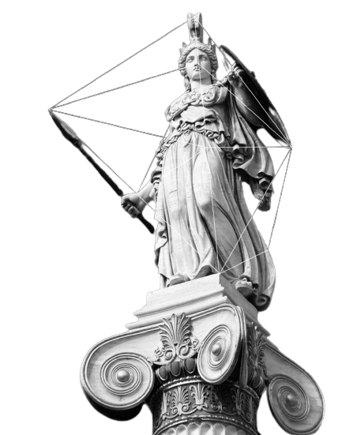

# WD-Seatwork_4_Tamayo

<a name="readme-top">

<br/>

<br />
<div align="center">
  <a href="https://github.com/IanClass-FEU/">
    
  </a>

<h2 align ="center"> NaiOyamat</h2>
  <h3 align="center"> SEATWORK 3 </h3>
  <p> This website showcases a variety of feature section designs and layouts using HTML and CSS. </p>
</div>
<div align="center">
</div>

<br />

## Waka time stats


---

<br />
<br />

<details>
  <summary>Table of Contents</summary>
  <ol>
    <li>
      <a href="#overview">Overview</a>
      <ol>
        <li>
          <a href="#key-components">Key Components</a>
        </li>
        <li>
          <a href="#technology">Technology</a>
        </li>
      </ol>
    </li>
    <li>
      <a href="#rule,-practices-and-principles">Rules, Practices and Principles</a>
    </li>
    <li>
      <a href="#resources">Resources</a>
    </li>
  </ol>
</details>

---

## Overview

The purpose of this website is to present a collection of dynamic and static header and footer designs created exclusively using CSS. This project aims to showcase the versatility and power of CSS in creating visually appealing and functional web components without relying on JavaScript or external libraries.

### Key Components
- Landing Page
  - Header
  - Live background
  - Hover Effect
  - Footer
  - Socials Buttons

- Feature Section 1
  - Header
  - Footer

- Feature Section 2
  - Header
  - Footer

- Footer Animation
  - Hover Effect


### Technology


## Rules, Practices and Principles
1. Always use `WD-` in the front of the Title of the Project for the Subject followed by your custom naming.
2. Do not rename any .html files; always use `index.html` as the filename.
3. Place Files in their respective folders.
4. All file naming are in camel case.
   - Camel case is naming format where there is no white space in separation of each words, the first word is in all lower case while the succeding words first letter are in upper followed by lower cased letters.
   - ex.: buttonAnimatedStyle.css
5. Use only `External CSS`.
6. Renaming of Pages folder names are a must, and relates to what it is doing or data it holding.
7. File Structure to follow below.

```
WD-ProjectName
└─ assets
|   └─ css
|   |   └─ style.css
|   └─ img
|   |   └─ fileWith.jpeg/.jpg/.webp/.png
|   └─ js
|       └─ script.js
└─ pages
|  └─ pageName
|     └─ assets
|     |  └─ css
|     |  |  └─ style.css
|     |  └─ img
|     |     └─ fileWith.jpeg/.jpg/.webp/.png
|     |  
|     └─ index.html
└─ index.html
└─ readme.md
```

## Resources

| Title | Purpose | Link |
|-|-|-|
| Icons | Used for incorporating icon in the header and footer | https://icons.getbootstrap.com/ |
| Layout | Used as a guide for layout and basic trouble shooting problems | https://www.w3schools.com/ |
| Live Background | Used to find background for landing page| https://www.wallpaperengine.io/ |

